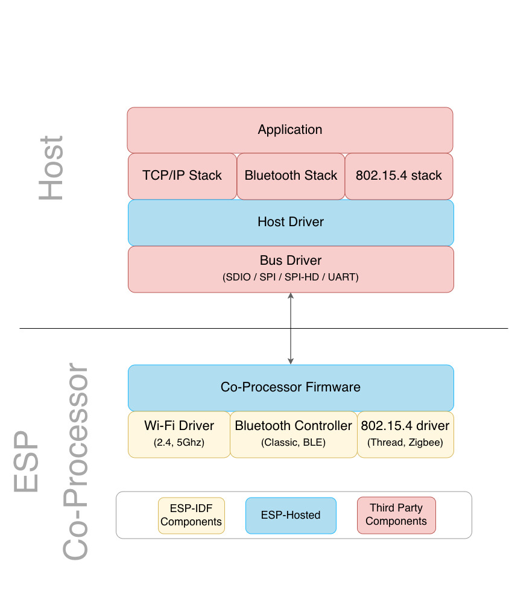
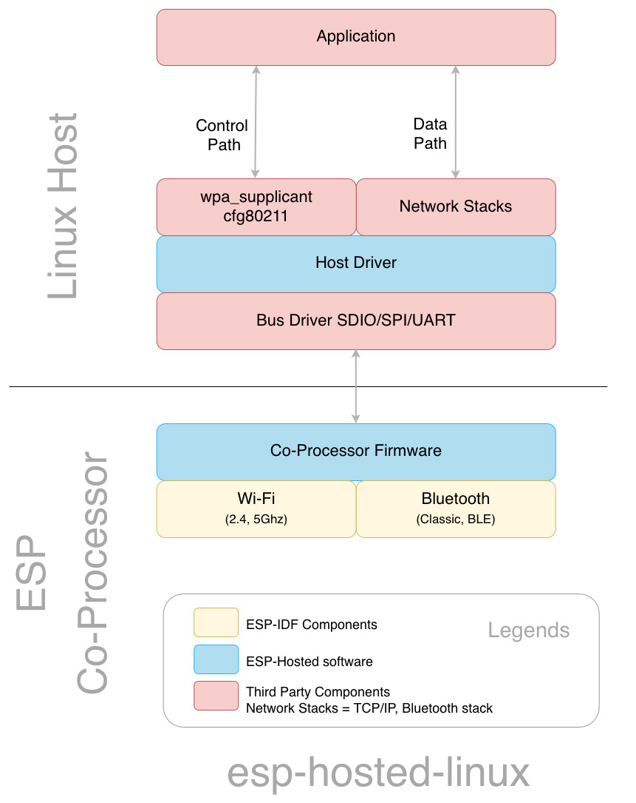
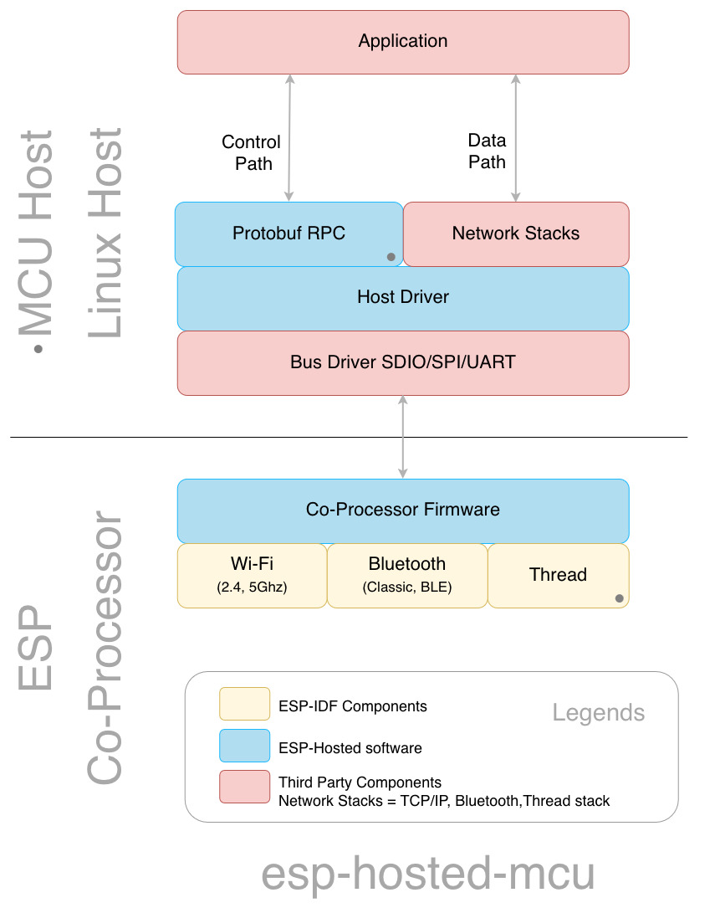

# ESP-Hosted

**ESP-Hosted**, an open-source connectivity solution, leverages Espressif SoCs
as dedicated **wireless co-processors** for Linux systems and microcontrollers.

It offloads protocol management to the co-processor, providing the host with full
Wi-Fi, Bluetooth/BLE, and Thread capabilities via standard peripheral buses
(SDIO, SPI, or UART).

## 🔑 Key features

- **Wi-Fi, Bluetooth/BLE and 802.15.4** over a single wired link
- **Fully open source code** &mdash; both co-processor and host
- **Broad host support:** an MCU, or Linux
- **Several buses:** SDIO, SPI, SPI-HD, UART, and combinations
- **Standard Wi-Fi security:** Open, WPA, WPA2, WPA3
- **Classic Bluetooth, BLE, BTDM** (4.2..6.0)
- **Shared networking:** ESP and host can share the same IP address
- **Power efficient:** low power modes for battery-powered use cases

## 🔗 High-Level Architecture

## 💡 ESP-Hosted Solutions

### 🔹 [esp-hosted-linux](https://github.com/espressif/esp-hosted-linux)

FullMAC solution for Linux hosts:

- Single step solution
- Seamless, out-of-the-box connectivity
- Native Wi-Fi interface (`wlan0`)
- Linux `cfg80211` integration
- `wpa_supplicant` and `NetworkManager` support
- Bluetooth using HCI
- 802.11 MAC runs on the ESP co-processor

### 🔹 [esp-hosted-mcu](https://github.com/espressif/esp-hosted-mcu)

RPC-based solution for MCU and Linux hosts:

- ESP-IDF way: fully-compatible ESP-IDF APIs, and event handlers usable at host
- App controls everything. APIs translate into portable protobuf based RPC
  requests to co-processor
- Host can use `esp_event` for co-processor events transparently
- Users can send their custom frames between host and co-processor
- 802.3 Ethernet interface
- Bluetooth using HCI
- 802.15.4 supports Thread and Zigbee
- Host and ESP can share a single IP address while the ESP maintains
  connectivity during host sleep

## 🤔 Choosing the Right Solution

The first question is how the host wants to reach Wi-Fi.

| Host | Host Wi-Fi interface | Solution |
| --- | --- | --- |
| Linux | Linux networking stack: `wlan0`, `cfg80211`, `wpa_supplicant`, `NetworkManager` | [esp-hosted-linux](https://github.com/espressif/esp-hosted-linux) |
| Linux or MCU | ESP-IDF `esp_wifi_*()` APIs | [esp-hosted-mcu](https://github.com/espressif/esp-hosted-mcu) |

By use case:

| Use case | Recommended |
| --- | --- |
| Standard Linux Wi-Fi config (`NetworkManager`, `wpa_supplicant`) | **esp-hosted-linux** |
| A native wireless interface, so existing tooling and scripts keep working | **esp-hosted-linux** |
| Linux with custom or proprietary control over Wi-Fi | **esp-hosted-mcu** |
| Embedded Linux boards (Raspberry Pi, BeagleBone) | either |
| ESP-IDF application code that should run unchanged on the host | **esp-hosted-mcu** |
| Wi-Fi in AP + station mode on Linux | **esp-hosted-mcu** |
| Wi-Fi and Bluetooth/BLE together | either |
| Classic Bluetooth | either |
| Connectivity kept up while the host sleeps | either |

## 📊 Solution Comparison

<table>
<tr>
<th width="50%">ESP-Hosted-Linux &mdash; FullMAC</th>
<th width="50%">ESP-Hosted-MCU &mdash; custom solution</th>
</tr>
<tr valign="top">
<td></td>
<td></td>
</tr>
<tr valign="top">
<td><ul><li>Seamless connectivity</li><li>Out-of-the-box networking</li><li>Existing Linux tooling and scripts keep working</li></ul></td>
<td><ul><li>Both Linux and MCU hosts use standard <a href="https://docs.espressif.com/projects/esp-idf/en/stable/esp32/api-reference/network/esp_wifi.html">ESP-IDF APIs</a></li><li>Single co-processor firmware for MCU and Linux hosts</li><li>Same host app works on MPU and MCU</li></ul></td>
</tr>
</table>

See the [detailed comparison](docs/comparison.md) to understand how the two solutions differ.

## 🚀 Getting Started

Active development is currently taking place in these repositories:

| Repository | Purpose | Support |
| --- | --- | --- |
| [esp-hosted-linux](https://github.com/espressif/esp-hosted-linux) | Standard Linux Solution | [Linux Issues](https://github.com/espressif/esp-hosted-linux/issues) |
| [esp-hosted-mcu](https://github.com/espressif/esp-hosted-mcu) | Custom solution for MCU and Linux hosts | [MCU Issues](https://github.com/espressif/esp-hosted-mcu/issues) |

## 🤝 Contributing and issues

Contributions are welcome &mdash; bug reports, fixes, new features and
documentation. ESP-Hosted is developed in the open, and every change goes
through review. For anything substantial, please open an issue first so the
approach can be agreed before you write the code.

## 🕰️ Legacy implementations

| Legacy implementation | Migrated to | Status | Code |
| --- | --- | --- | --- |
| ESP-Hosted-NG | [esp-hosted-linux](https://github.com/espressif/esp-hosted-linux) | Legacy | [`legacy/fg-ng`](https://github.com/espressif/esp-hosted/tree/legacy/fg-ng) |
| ESP-Hosted-FG | [esp-hosted-mcu](https://github.com/espressif/esp-hosted-mcu) | Legacy | [`legacy/fg-ng`](https://github.com/espressif/esp-hosted/tree/legacy/fg-ng) |
